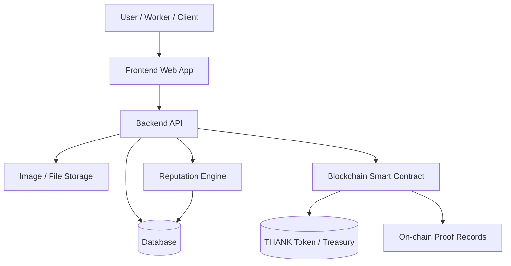
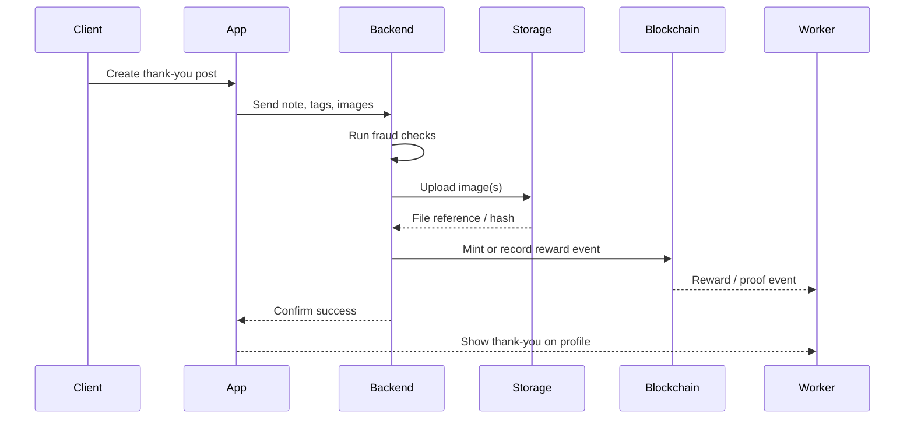
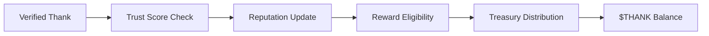
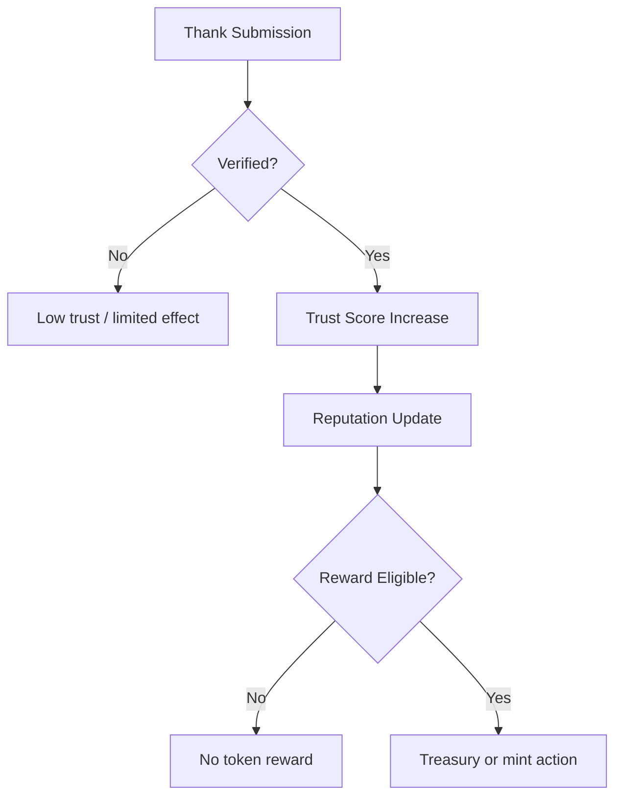
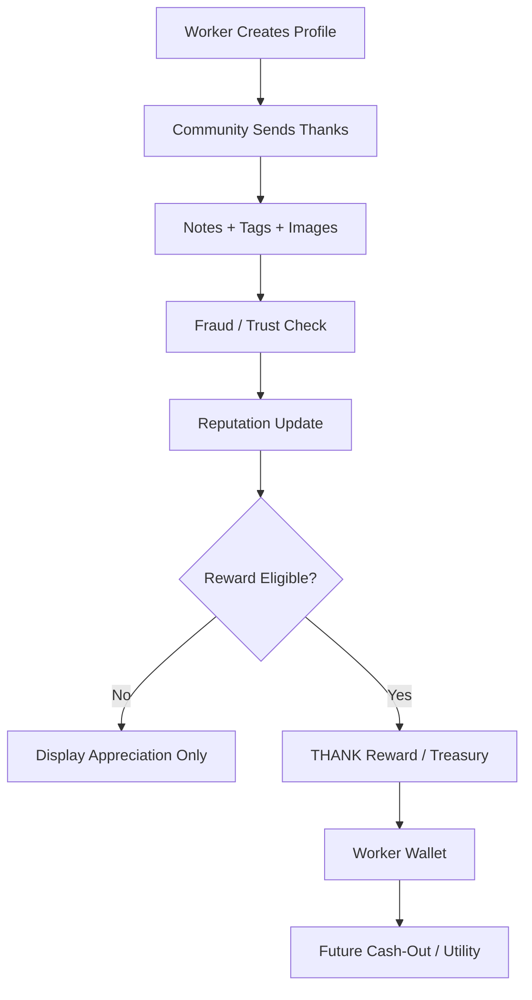

# THANK Platform Master Blueprint

## 1) Vision
A decentralized appreciation platform where everyday workers can be publicly thanked, recognized, and eventually rewarded through a tokenized system.

The core idea is simple:

- A worker creates a profile.
- Clients, customers, employers, and community members can send thank-you posts.
- Each thank can include a short note, tags, and optional images.
- Verified appreciation increases the worker’s reputation.
- Over time, reputation can translate into rewards through the **$THANK** token economy.

The platform is not just a social network. It is a **proof-of-appreciation system** for labor and contribution.

---

## 2) Problem Statement
People do work every day, but recognition is often missing.

Examples:

- A cleaner keeps a building usable.
- A mechanic fixes a vehicle at night.
- A teacher shapes minds.
- A farmer grows food.
- A laborer builds, carries, repairs, and maintains.

Most of this work is valuable, but the appreciation is usually private, informal, or forgotten.

This platform makes appreciation visible, searchable, and potentially rewardable.

---

## 3) Core User Flow

1. A new user registers as a worker.
2. They create a profile with photo, profession, bio, and optional verification.
3. Other users can search, tag, and thank them.
4. A thank-you post may include text, images, and proof of work.
5. Verified thanks increase reputation.
6. Reputation can later unlock token rewards.
7. The worker may eventually use or liquidate earned tokens.

---

## 4) Main Feature Set

### Worker Profile
Each worker profile may include:

- Profile photo
- Full name or display name
- Profession
- Skills
- City / country
- Experience
- Bio
- Verification badges
- Thank count
- Trust score
- Wallet address (if web3 is enabled)

### Thank You Posts
A thank-you post may include:

- Sender
- Tagged worker(s)
- Note
- Images
- Timestamp
- Verification status
- Optional location or job reference

### Reputation System
A worker’s public reputation can be based on:

- Number of thanks received
- Number of verified thanks
- Trust score of senders
- Age of account
- Proof of work
- Community reports and fraud signals

### Token Layer
The **$THANK** token is the economic layer.

Possible design goals:

- Reward real labor appreciation
- Create measurable utility
- Allow future cash-out or marketplace use
- Support brand participation and advertising demand

---

## 5) Recommended Product Philosophy
The best version of this platform is not “crypto first.”

It should be:

1. **Recognition first**
2. **Trust second**
3. **Token utility third**
4. **Cash-out last**

That reduces hype, improves trust, and gives the platform a real reason to exist.

---

## 6) Suggested System Architecture

### Frontend
Use a modern web stack:

- Next.js or React
- Tailwind CSS
- Responsive design
- Wallet connection support if web3 is enabled

### Backend
Use a standard backend for business logic:

- Node.js / Express or NestJS
- MongoDB or PostgreSQL
- File storage for images
- Rate limiting and fraud checks
- Token reward orchestration

### Blockchain Layer
Use blockchain for trust and value transfer:

- Polygon or Solana for low fees
- Smart contracts for token minting, treasury control, or proof records
- Public on-chain verification of key events if needed

### Storage Layer
Do **not** store images directly on-chain.

Use:

- IPFS
- Arweave
- Cloud storage

Store only hashes or references on-chain.

---

## 7) Architecture Diagram



---

## 8) Thank Flow Diagram



---

## 9) Token Economy Concept
The token economy must avoid uncontrolled inflation.

### Option A: Mint-per-thank
This is simple, but risky.

Problem:

- Too many fake thanks can create too many tokens.
- The token supply may become inflated quickly.

### Option B: Treasury-based rewards
This is safer.

A fixed or capped treasury distributes rewards based on:

- Verified appreciation
- Trust score
- Worker reputation
- Community quality signals

This keeps the economy more controlled.

---

## 10) Recommended Token Model
A stronger model is:

- Token supply is capped or carefully managed
- Rewards come from a treasury
- Only trusted or verified appreciation can trigger rewards
- High-value actions unlock higher rewards

Example flow:



---

## 11) Fraud Prevention Strategy
A daily limit is useful, but it is not enough on its own.

### Risks
- Fake accounts
- Self-thanking
- Thank rings
- Purchased SIM farms
- Bot activity
- Repeated low-quality posts

### Better defenses
Use multiple layers:

- Phone verification
- Email verification
- Optional government ID or employer verification
- Trust score system
- Rate limits per user and per recipient
- Same-recipient cooldowns
- Image and proof-of-work checks
- Manual review for suspicious activity
- Community reporting

### Trust Score Example

| Signal | Weight |
|---|---:|
| Phone verified | +10 |
| Email verified | +5 |
| Account age | +20 |
| Government ID | +50 |
| Verified work evidence | +30 |
| Fraud report | -50 |

---

## 12) Anti-Fraud Diagram



---

## 13) Images and Authenticity
Images should increase credibility, not just decoration.

Useful image types:

- Before / after job photos
- Work completion snapshots
- Team or site photos
- Receipt or task proof
- Event photos

Best practice:

- Store images off-chain
- Save their hashes or references on-chain
- Attach them to the thank-you post
- Use moderation checks for abuse

---

## 14) Product and Community Growth Strategy
The platform can grow in phases.

### Phase 1: MVP
Focus on community and trust:

- Accounts
- Profiles
- Thank posts
- Tags
- Image uploads
- Reputation
- Search

### Phase 2: Verification
Add stronger trust:

- Verified workers
- Verified clients
- Anti-fraud scoring
- Moderation tools

### Phase 3: Token Layer
Introduce token economics:

- Wallet support
- Treasury logic
- Reward rules
- On-chain proofs

### Phase 4: Ecosystem
Expand the platform:

- Job marketplace
- Brand sponsorships
- Ads
- Hiring portal
- Local economy integrations

---

## 15) Business Model Options
The token economy may not be enough by itself.

Additional revenue sources:

- Featured worker profiles
- Verified badges
- Business pages
- Hiring tools
- Ads
- Commission on job bookings
- Brand sponsorships

This reduces dependence on token speculation.

---

## 16) Recommended MVP Scope
Build the first version without blockchain complexity.

### MVP Must Have
- Worker profile creation
- Thank-you posts
- Tagging multiple users
- Image upload
- Search and discoverability
- Trust score
- Basic moderation
- Notifications

### MVP Should Not Have Yet
- Full token cash-out
- Complex liquidity pools
- Over-engineered smart contracts
- Speculative features

---

## 17) Future Blockchain Integration
When the platform has real usage, blockchain can be added carefully.

Possible uses:

- Proof of appreciation
- Reward distribution
- Token treasury
- Public verification of key events
- Worker-owned digital reputation history

Smart contract functions may include:

- Reward worker
- Record verified thank
- Update reward eligibility
- Transfer token
- Pause in emergency

---

## 18) Smart Contract Example Concept

```solidity
function rewardLaborer(address laborerAddress) external onlyPlatformBackend {
    _mint(laborerAddress, 10 * 10**18);
}
```

This is simple conceptually, but a real production design should be more controlled.

Prefer:

- Access control
- Treasury limits
- Reward rules
- Anti-abuse checks
- Emergency pause controls

---

## 19) Final System Vision
The platform becomes a public appreciation network where workers can build:

- Recognition
- Reputation
- Proof of work
- Digital identity
- Economic value

Instead of measuring only likes, followers, or popularity, the platform measures **real contribution**.

That is the strongest version of the idea.

---

## 20) Final Mermaid Summary Diagram



---

## 21) Build Order Recommendation

1. Define the MVP.
2. Design the database and profile schema.
3. Build thank-you posting and tagging.
4. Add image uploads.
5. Add trust and moderation.
6. Add reputation scoring.
7. Build analytics and worker profiles.
8. Add blockchain reward logic only after product-market validation.

---

## 22) One-Line Mission Statement
**A platform that turns gratitude into visible reputation and, eventually, into real economic value for workers.**

